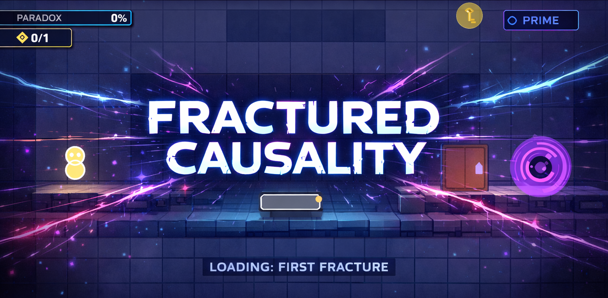

<div align="center">



# 🌌 FRACTURED CAUSALITY

### *Where Every Action Echoes Across Parallel Universes*

[](https://www.python.org/)
[](https://www.pygame.org/)
[](LICENSE)
[]()

<p align="center">
  <a href="#-about">About</a> •
  <a href="#-features">Features</a> •
  <a href="#-installation">Installation</a> •
  <a href="#-gameplay">Gameplay</a> •
  <a href="#-controls">Controls</a> •
  <a href="#-architecture">Architecture</a>
</p>

</div>

---

## 📖 About

**Fractured Causality** is an innovative puzzle-adventure game that challenges your understanding of cause and effect across parallel dimensions. Built entirely with Python and Pygame, this project showcases advanced game development concepts including event-driven architecture, causal graph systems, and complex state management.

### 🎭 The Story

You are **The Archivist**, a being who exists outside the constraints of normal causality. Blessed—or cursed—with the ability to traverse parallel universes at will, you witness how reality fractures and reforms with each choice made.

But power comes with consequences. Every action you take in one universe creates ripples across all timelines. Kill an enemy in the **Prime** universe, and their echo might vanish from **Echo**—or grow stronger in **Fracture**. Destroy an object here, and its causal descendants cease to exist there.

**Your mission:** Navigate through three increasingly complex levels, solve causal puzzles that span multiple realities, and reach the exit portal before the paradox you generate collapses all of existence.

> *Break causality. Solve the impossible. Don't collapse the multiverse.*

---

## ✨ Features

### 🌀 **Multiverse System**
- **Three Parallel Universes**: Prime (Blue), Echo (Green), and Fracture (Red)
- **Seamless Universe Switching**: Toggle between realities with smooth transitions
- **Persistent State Management**: Each universe maintains its own entity states
- **Visual Universe Indicators**: Always know which reality you're in

### 🔗 **Causal Graph System**
- **Entity Dependencies**: Objects and enemies are causally linked across universes
- **Dynamic Cause-Effect Chains**: Actions propagate through causal connections
- **Causal Sight Mode**: Visualize the hidden connections between entities
- **Multiple Operators**: AND, OR, NOT, XOR logic for complex puzzles

### ⚠️ **Paradox Management**
- **Real-time Paradox Tracking**: Monitor reality stability
- **Tiered Warning System**: Stable → Unstable → Critical → Collapse
- **Strategic Paradox Use**: Some puzzles require controlled paradox generation
- **Visual Feedback**: Glitching effects intensify as paradox increases

### 🎮 **Rich Gameplay**
- **3 Hand-Crafted Levels**: Progressive difficulty with unique puzzle mechanics
- **Multiple Entity Types**: Keys, variant doors, bridges, trees, portals
- **Enemy AI**: Shades, Echo Walkers, and Paradox Wraiths with unique behaviors
- **Interactive Objects**: Causal Stones, Echo Switches, and more

### 🎨 **Polished Presentation**
- **Cyberpunk Aesthetic**: Neon colors, glowing effects, animated UI
- **Full Mouse & Keyboard Support**: Intuitive controls and menu navigation
- **In-Game Tutorial**: Comprehensive "How to Play" screen
- **Visual Effects**: Screen transitions, particle systems, universe-switching animations
- **Responsive HUD**: Real-time paradox meter, key counter, universe indicator

---

## 🚀 Installation

### Prerequisites

- **Python 3.13+** (or Python 3.10+)
- **Pygame 2.6.1** (or Pygame 2.0+)

### Quick Start

1. **Clone the repository**
   ```bash
   git clone https://github.com/SamirShaikh03/Fractured-Causality
   cd fractured-causality
   ```

2. **Install dependencies**
   ```bash
   pip install -r requirements.txt
   ```

3. **Run the game**
   ```bash
   python main.py
   ```

### Alternative Installation

If you prefer using a virtual environment:

```bash
# Create virtual environment
python -m venv venv

# Activate it
# Windows:
venv\Scripts\activate
# macOS/Linux:
source venv/bin/activate

# Install dependencies
pip install pygame

# Run the game
python main.py
```

---

## 🎮 Gameplay

### Core Mechanics

#### **Universe Switching**
Press **SPACE** to cycle through three parallel universes. Each universe has different entity configurations, but all are causally connected. Watch for the colored border that indicates your current reality.

#### **Causal Relationships**
Entities can have causal dependencies:
- **Parent → Child**: If the parent is destroyed, the child ceases to exist
- **Mirrored States**: Some entities share states across universes
- **Conditional Existence**: Doors that only open when keys are collected

Use **TAB** to toggle **Causal Sight** and visualize these connections as glowing lines between entities.

#### **Paradox System**
Every action that breaks causality generates paradox:
- **Low Paradox (0-30%)**: Stable - Safe to continue
- **Moderate Paradox (30-60%)**: Unstable - Visual distortions appear
- **High Paradox (60-85%)**: Critical - Reality begins glitching
- **Extreme Paradox (85-100%)**: Collapse - **GAME OVER**

Some puzzles require generating paradox to progress, but manage it carefully!

### Puzzle Examples

**Level 1 - The Basics:**
- Learn universe switching
- Collect keys in one universe to unlock doors in another
- Understand basic causal relationships

**Level 2 - Bridges and Echoes:**
- Use Echo Switches to build bridges between universes
- Navigate complex causal chains
- Manage multiple keys and variant doors

**Level 3 - The Ancient Tree:**
- Destroy a tree in one universe to remove Shades in another
- Master paradox management
- Solve multi-step causal puzzles

---

## 🎹 Controls

### Movement & Interaction

| Key | Action | Description |
|-----|--------|-------------|
| **W A S D** | Move | Navigate in all four directions |
| **Arrow Keys** | Move | Alternative movement controls |
| **E** | Interact | Pick up keys, use doors, activate objects |
| **SPACE** | Switch Universe | Cycle through Prime → Echo → Fracture |
| **TAB** | Causal Sight | Toggle visualization of entity connections |
| **ESC** | Pause | Open pause menu |

### Menu Navigation

| Input | Action |
|-------|--------|
| **↑ ↓ / W S** | Navigate menu options |
| **Mouse Hover** | Highlight menu items |
| **ENTER / Click** | Select menu option |
| **ESC** | Go back / Resume game |

### Tips

- 💡 **Stuck on a puzzle?** Try switching universes—paths that are blocked in one reality might be open in another.
- 🔍 **Use Causal Sight often** to understand which entities depend on each other.
- ⚠️ **Watch your paradox meter** at the top of the screen—too much paradox means game over!
- 🗝️ **Keys persist across universes**, so collect them strategically.

---

## 🏗️ Architecture

### Project Structure

```
Fractured-Causality/ 
│     
├── main.py                            # Application entry point
├── requirements.txt                   # Python dependencies
├── README.md                          # Project documentation
│     
├── docs/                              # Additional documentation
│   ├── GDD.md                         # Game Design Document
│   ├── ARCHITECTURE.md                # Technical architecture guide
│   └── DESIGN_PATTERNS.md             # Design patterns used
│     
├── src/                               # Source code
│   │    
│   ├── core/                          # Core engine systems
│   │   ├── game.py                    # Main game loop and state management
│   │   ├── settings.py                # Game constants and configuration
│   │   ├── states.py                  # Game state definitions
│   │   └── events.py                  # Event system (pub-sub pattern)
│   │    
│   ├── multiverse/                    # Multiverse mechanics
│   │   ├── universe.py                # Universe container and management
│   │   ├── multiverse_manager.py      # Universe switching logic
│   │   ├── causal_node.py             # Causal entity representation
│   │   ├── causal_graph.py            # Dependency graph system
│   │   └── paradox_manager.py         # Paradox tracking and effects
│   │ 
│   ├── entities/                      # Game entities
│   │   ├── entity.py                  # Base entity class
│   │   ├── player.py                  # Player entity with controls
│   │   ├── objects/                   # Interactive objects
│   │   │   ├── key.py  
│   │   │   ├── variant_door.py  
│   │   │   ├── exit_portal.py   
│   │   │   ├── bridge.py  
│   │   │   ├── tree.py 
│   │   │   ├── causal_stone.py  
│   │   │   └── echo_switch.py   
│   │   └── enemies/                   # Enemy entities
│   │       ├── shade.py   
│   │       ├── echo_walker.py   
│   │       └── paradox_wraith.py   
│   │ 
│   ├── levels/                        # Level definitions
│   │   ├── level_base.py              # Base level class
│   │   ├── level_loader.py            # Level loading system
│   │   ├── level_01.py                # Tutorial level
│   │   ├── level_02.py                # Intermediate level
│   │   └── level_03.py                # Advanced level
│   │ 
│   ├── systems/                       # Game systems
│   │   ├── input_handler.py           # Input processing
│   │   ├── camera.py                  # Camera and viewport
│   │   └── animation.py               # Animation system
│   │ 
│   ├── ui/                            # User interface
│   │   ├── menu.py                    # Main menu system (mouse + keyboard)
│   │   ├── hud.py                     # Heads-up display
│   │   ├── universe_indicator.py      # Universe display
│   │   ├── paradox_meter.py           # Paradox visualization
│   │   └── causal_sight_overlay.py    # Causal connections overlay
│   │ 
│   ├── rendering/                     # Rendering systems
│   │   ├── renderer.py                # Main renderer
│   │   ├── effects.py                 # Visual effects and transitions
│   │   └── particles.py               # Particle system
│   │ 
│   └── utils/                         # Utilities
│       └── debug.py                   # Debug tools and logging
│  
└── assets/                            # Game assets (if any)
```

### Key Design Patterns

- **Event-Driven Architecture**: Decoupled communication via pub-sub events
- **State Machine**: Clean game state management (Menu, Playing, Paused, etc.)
- **Entity-Component System**: Flexible entity composition
- **Observer Pattern**: Event system for cross-component communication
- **Strategy Pattern**: Different AI behaviors for enemies
- **Factory Pattern**: Level loading and entity creation

### Technical Highlights

- **Custom Causal Graph System**: Directed acyclic graph for entity dependencies
- **Multi-Universe State Management**: Efficient handling of parallel realities
- **Paradox Calculation Engine**: Real-time stability tracking
- **Visual Effect Pipeline**: Layered rendering with transitions and particles
- **Modular Architecture**: ~8,500 lines of clean, documented Python code

---

## 🎓 Development

This project was built following professional game development practices:

- ✅ **Clean Architecture**: Separation of concerns, modular design
- ✅ **Design Patterns**: Event-driven, state machines, observers
- ✅ **Comprehensive Documentation**: GDD, architecture docs, code 
- ✅ **UX Best Practices**: Tutorial screen, mouse support, visual feedback

---

## 📊 Stats

- **Total Lines of Code**: ~8,500+
- **Python Files**: 42
- **Game Levels**: 3
- **Entity Types**: 13+
- **Development Time**: 5 days (structured)
- **Design Patterns Used**: 6+

## 📝 License

This project is licensed under the **MIT License** - see the [LICENSE](LICENSE) file for details.

---

## 🌟 Acknowledgments

- Built with **Python** and **Pygame**
- Inspired by quantum mechanics, multiverse theory, and causal logic
- Created as a showcase of advanced game development techniques

---

<div align="center">

### 🎮 Ready to Fracture Reality?

**[Download Now](#-installation)** | **[View Documentation](docs/)** | **[Report Bug](../../issues)**

---

*Developed with 💜 by Samir Shaikh | © 2026 Fractured Causality*

</div>
