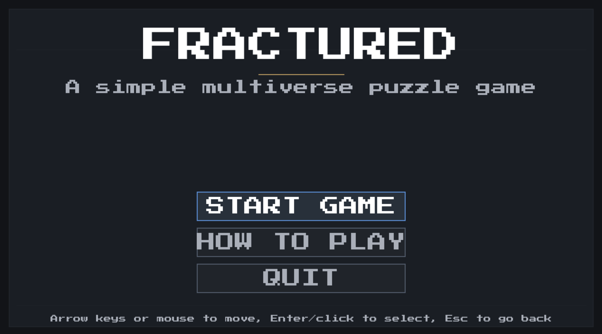

<div align="center">



# FRACTURED CAUSALITY

### *Where Every Action Echoes Across Parallel Universes*

</div>

---

## What's This?

A puzzle-adventure game where you hop between three parallel universes—Prime, Echo, and Fracture. You're **The Archivist**, and you can break the laws of causality. But every action creates ripples across realities. Kill an enemy here, and they might disappear there. Destroy a bridge, and its effects cascade through time. The catch? Build up too much paradox and reality collapses. Game over.

You've got three levels to solve causal puzzles, collect keys, avoid enemies, and reach the exit before everything falls apart.

---

## Quick Setup

```bash
# Install dependencies
pip install -r requirements.txt

# Run it
python main.py
```

**Needs**: Python 3.10+ and Pygame 2.0+

---

## How to Play

- **W/A/S/D** or arrows to move
- **SPACE** to switch universes
- **TAB** to see which objects are connected (Causal Sight)
- **E** to interact with stuff
- **ESC** to pause

Some puzzles need universe switching. Some need you to break things in one reality to fix them in another. Balance your paradox or you're toast.

---

## The Tech

Built in Python with Pygame. ~8,500 lines of code across 42 files. Features a custom causal graph system, multi-universe state management, and a paradox tracking engine. Clean architecture, solid design patterns, fully playable across 9 hand-crafted levels.

**License**: MIT | **Made by**: Samir Shaikh | **2026**
